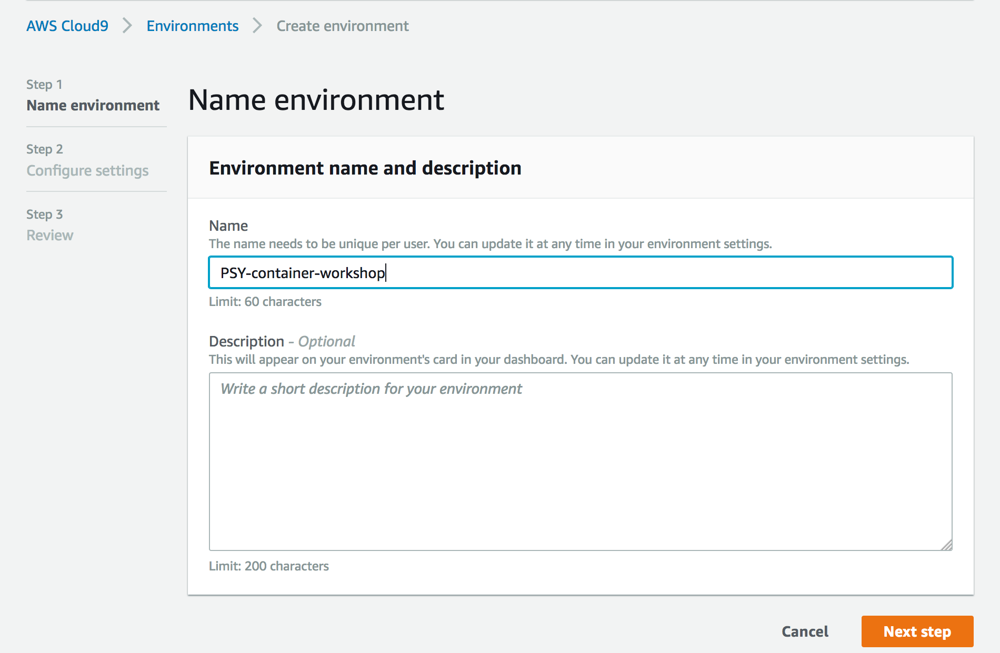
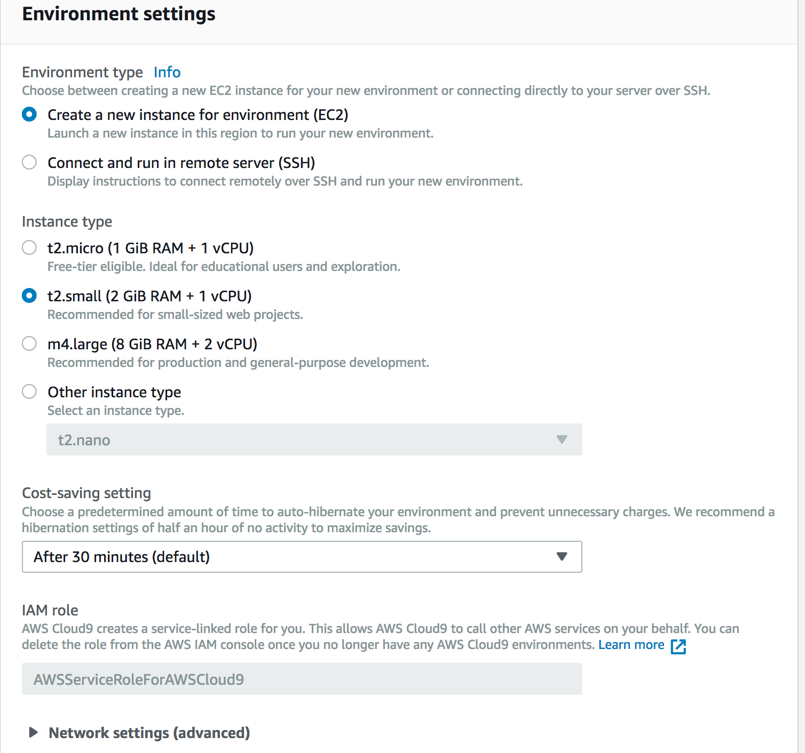
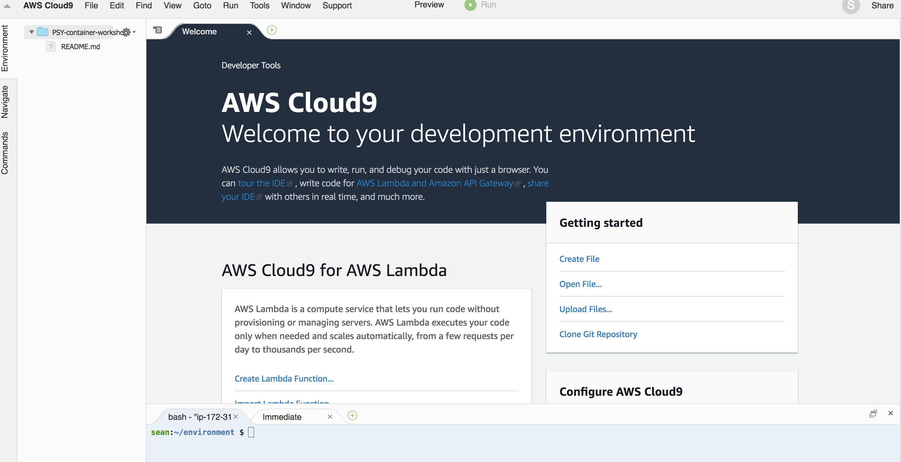

## Preparing a your Lab environment 
- This module is for configuring your dev environment
- We will show the set up process of Cloud9 Env and Java Develpoment environment.
- Cloud 9 is recommended as your dev IDE for studying this workshop


## 1. Using Cloud9 


### 1.1. Create your Cloud9 environments
Before starting, you need to configure **your EC2 role** for Cloud9 environment instance.

##### Launch your instance 

1. Specify Environment name : "YOUR INITIAL-container-workshop"



2. Select "Create a new instance"
3. Select "t2.small"


	
	4. Review and launching your environment	
	
##### Open your environment


	

### 1.2 Update your environment

- Follow the "Java Sample for AWS Cloud 9"

ref : https://docs.aws.amazon.com/cloud9/latest/user-guide/sample-java.html


### 1.3 Update your environment (optional reference)

1. Check java --version and check the location of Java 

```
$ java -version
java version "1.7.0_171"

$ which java
/usr/bin/java

```
	
2. Upgrade java version to 1.8 (for development, we need to upgrade Java version and install required packages)
	
```
sudo yum list available java\*      # check available java version
sudo yum -y install java-1.8.0 java-1.8.0-openjdk-devel        # install 1.8 java and javac
sudo yum remove java-1.7.0-openjdk -y # remove 1.7
java -version											# check java version
```

3. Update JAVA_HOME environment variable in .bashrc

```
vi ~/.bashrc
### add follwing content
export JAVA_HOME=/usr/
```
	
4. Install Maven

```
cd /usr/local
sudo wget http://www-eu.apache.org/dist/maven/maven-3/3.5.3/binaries/apache-maven-3.5.3-bin.tar.gz
sudo tar xzf apache-maven-3.5.3-bin.tar.gz
sudo ln -s apache-maven-3.5.3  maven

sudo vi /etc/profile.d/maven.sh

# add following content.
export M2_HOME=/usr/local/maven
export PATH=${M2_HOME}/bin:${PATH}

# load the environment variables in current shell using following command.
source /etc/profile.d/maven.sh

# check the loaded environment variables  
echo $PATH             
```

5. Install AWS CLI and cofigure it
https://docs.aws.amazon.com/cli/latest/userguide/installing.html


### 1.4 Install docker

```
sudo yum install docker
docker --help
```

### 1.5 Install all other tools
1. curl
2. 
3. Install ECS-CLI (optional)
https://docs.aws.amazon.com/AmazonECS/latest/developerguide/ECS_CLI_installation.html