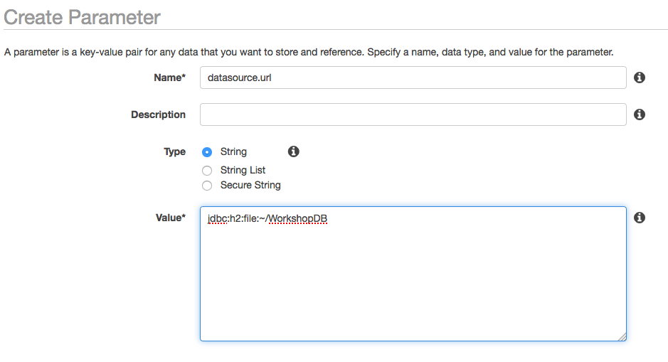
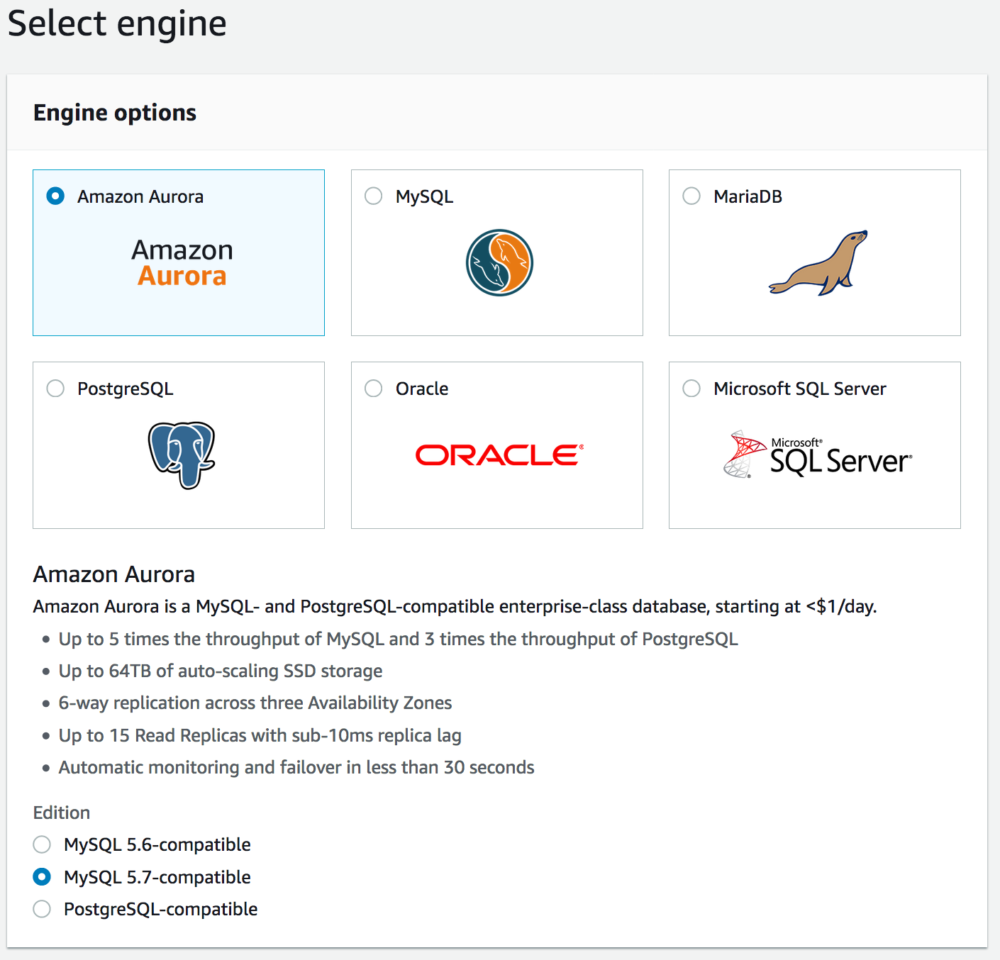
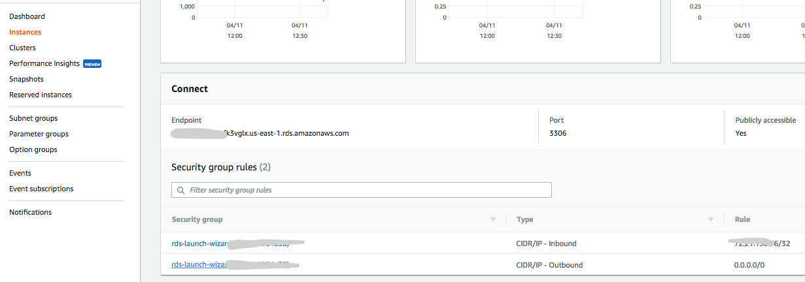
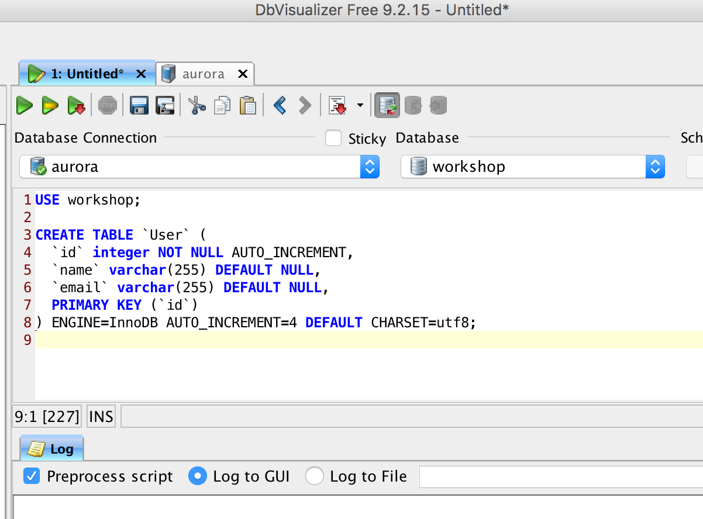
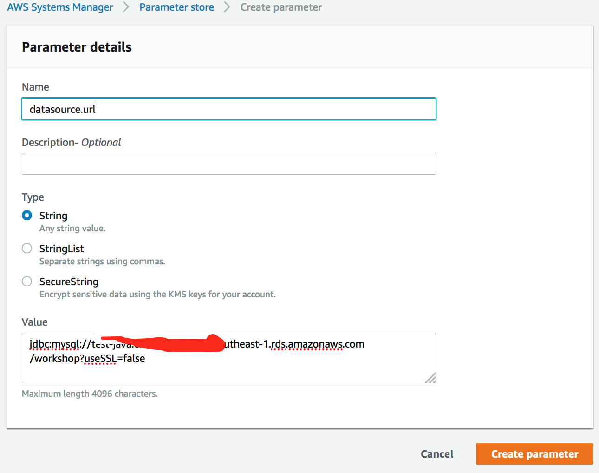
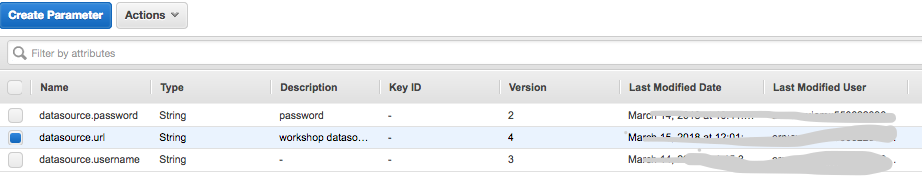

## 1. Lab 1 :  Create Your First Docker Images
In this module, we introduce the fundamental concept of CodeStar and how to build a quick CI/CD pipeline with CodeStar. You will be provided with hands-on on migrating your project to CodeStar project you created and how to build docker environment for your application
- Create a docker for your application
- Create a CodeBuilder for Java compilation and Dockerization
- Push docker image to ECR
- Getting a docker from ECR and check it's availability on local machine


### 1. Create a docker for this application.

#### 1.1 Dowonload all sources

git clone https://github.com/aws-asean-builders/aws-container-workshop.git

#### 1.1 Compile your local files

1. Run maven command

```
cd lab-01

mvn compile package -Dmaven.test.skip=true

ls -al target

java -jar target/lab-01-0.1.0.jar

```

2. Check the result

Open Browser :
localhost:8080

```
# test user
curl 'localhost:8080/workshop/users/all'

curl 'localhost:8080/workshop/users/add?name=First&email=ex1@gmail.com'

curl 'localhost:8080/workshop/users/deleteall'

curl 'localhost:8080/workshop/users/all'

# test image
curl 'localhost:8080/workshop/images/all'

curl 'localhost:8080/workshop/images/add?userid=1&bucket=seon-singapore&prefix=/output&filename=test.PNG'

curl 'localhost:8080/workshop/images/deleteall'

curl 'localhost:8080/workshop/images/all'

```


#### 1.2 Create your first local docker 

refer : 
https://docs.aws.amazon.com/AmazonECS/latest/developerguide/docker-basics.html#docker-basics-create-image

- You need to install docker in your local server

```
sudo yum install -y docker
```

#### 1.3 Run your first docker application

1. Check a Dockerfile

```
FROM openjdk:8-jdk-alpine
VOLUME /tmp
ARG JAR_FILE
COPY ${JAR_FILE} app.jar
ENTRYPOINT ["java","-Djava.security.egd=file:/dev/./urandom","-jar","/app.jar"]
```
2. Create a docker image
	
```	
docker build -t hello-world . --build-arg JAR_FILE="./target/<YOUR_ARTIFACT_FILE>"
```

3. Run docker in your local machine
	
```
docker run -p 8080:8080 -it hello-world bash
```

4. Check the application in your console
	
5. Change a host port for 80
	
```
docker run -p 80:8080 -it hello-world bash
```

#### 1.4 More commands for docker

1. run docker as a daemon

```
docker run -d -p 80:8080 --name=test-1 hello-world 
	
docker build -t hello-world . --build-arg JAR_FILE="<YOUR_ARTIFACT_FILE>"
	
```
2. Check running docker and stop it

```
docker ps

docker stop <CONTAINER ID>
```

3. Remove all container

```
#stop all running docker
	docker stop $(docker ps -a -q)
# Delete all containers
docker rm $(docker ps -a -q)
# Delete all images
docker rmi $(docker images -q)
```

#### 1.5 Debug Command

1. List stack:

```
docker stack ls
```

2. List services in the stack:

```
docker stack services myapp
```

3. List containers:

```
docker container ls -f name=myapp*
```

4. Get logs for all the containers in the webapp service:

```
docker service logs myapp_webapp-service
```


### 2 Create a ECR repository

1. Run a following AWS CLI command

```
aws ecr create-repository --repository-name java-workshop	
	
```
2. Check response and save a repository ARN

```
{
    "repository": {
        "registryId": "550622896891", 
        "repositoryName": "java-workshop	", 
        "repositoryArn": "arn:aws:ecr:ap-southeast-1:<account id>:repository/java-workshop	", 
        "createdAt": 1516947869.0, 
        "repositoryUri": "<account id>.dkr.ecr.ap-southeast-1.amazonaws.com/java-workshop	"
    }
}

```

3. Get Authentication

```
aws ecr get-login --no-include-email --region ap-southeast-1
```

4. Run above result


### 3. Push your images

```
docker build -t java-workshop:latest. --build-arg JAR_FILE="module-09.jar"
docker tag java-workshop:latest  <aws_account_id>.dkr.ecr.<your_region>.amazonaws.com/java-workshop:latest 

docker push  <aws_account_id>.dkr.ecr.<your_region>.amazonaws.com/java-workshop:latest
```


### 4. Check pushed image in your local machine

1. You can describe the images in a repository using following command.

```
aws ecr describe-images --repository-name java-workshop

```

2. Pull the image using the docker pull

```
docker pull <aws_account_id>.dkr.ecr.<your_region>.amazonaws.com/java-workshop:latest

docker pull 550622896891.dkr.ecr.ap-southeast-1.amazonaws.com/java-workshop:latest

docker images 

docker run -d -p 80:8080 --name=hello-world <IMAGE_ID>

docker run -d -p 80:8080 --name=hello-world 845b33e64e98

docker ps
```

<hr>
<hr>
<hr>

## Lab 1-2 : Advanced applicaiton building
If you have enough time, are able to complete this Lab too in Day 1. Otherwise, this lab could be covered in Day 3.
This lab shows the modification of Java spring application to use SSM and Amazon RDS for MySQL and will create a docker images to support all these AWS services.

### 1. Run your code

```
cd lab-01-2

mvn compile package -Dmaven.test.skip=true

```

### 2. Externalize Configuration 

#### 2.1. Configure AWS CLI to allow application to get access key and secret key 
**If you configured AWS CLI configuraiton before, then skip this 1.1 

```
> aws configure
> AWS Access Key ID [None]: [your key]
> AWS Secret Access Key [None]: [your key]
> AWS region : [your region]
```

#### 2.2. Configure ParameterStore in System Manager 
- AWS Systems Manager Parameter Store provides secure, hierarchical storage for configuration data management and secrets management. You can store data such as passwords, database strings, and license codes as parameter values.
Complete the following tasks to configure application parameters for ParameterStore (select your region, for example, us-east-1, ap-southeast-1 and so forth)


1. Open the System Manager Cosole and go to Parameter Store
2. Create parameters in ParameterStore for database URL, database username and password in your region
3. Specify **datasource.url** as **jdbc:h2:file:~/WorkshopDB**
4. Specify **datasource.username** as **sa**
5. Specify **datasource.password** as **12345678**



#### 2.3. Rerun and check it

- Check your EC2 role, if you have errors after creating parameters in Parameter Store.


### 3. Expose Application Metrics and Information
We are using "spring-boot-starter-actuator", please check application metrics and information using following command

```
curl localhost:8080/heath
curl localhost:8080/beans
```

### 4. Launch Aurora for MySQL

#### 4.1. Create Aurora MySQL

	1. Open the Amazon RDS console : https://console.aws.amazon.com/rds/home?region=us-east-1#
	2. Select Aurora for MySQL 5.7 Database engine and select the 
	3. Create a DB instance configuring database name, username, password.
	4. Remember your master username and password to perform next step
	



	5. Create database in configuration page (for example, workshop)
	
Name your Aurora database as TSA-Workshop, and keep the rest of the values as default.
- Select db instances of your choice (e.g. db.t2.micro)
- Keep the default multi-AZ
- Cluster name: TSA-Workshop-Cluster
- Database name: workshop
- Make sure that the database is publicly accessible.
- Keep everything else as default and then launch the Aurora database.
- At your left panel, click on the 'instances' menu. You should see that RDS is creating two database instances for you (one reader and writer role respectively).

	6. Wait until completing the creation of Aurora for MySQL 

Endpoint looks like this - "tsa-workshop.ctdltt3xxxx.us-east-1.rds.amazonaws.com"
	
	7. Check Endpoint and Security Group
	

	
	8. Change Security Group configuration, if you need.
	9. Check connectivity from your local computer (if you don't have any MySQL client, please install it)


```
brew install mysql

mysql -h <endpoint of your instance> -u <master username> -p
```
	
	10. Create user and it's privilege using following SQL commands(use MySQL client in your computer)

```
mysql> create user 'demouser'@'%' identified by '12345678'; -- Creates the user
mysql> grant all on workshop.* to 'demouser'@'%'; -- Gives all the privileges to the new user on the newly created 
```

	12. Check the tables, there is no table yet.

```
show tables;

```
	13. You can use GUI tool for MySQL (for example, DBVisualizer)
	
	


#### 4.2. Configure ParameterStore in System Manager 

AWS Systems Manager Parameter Store provides secure, hierarchical storage for configuration data management and secrets management. You can store data such as passwords, database strings, and license codes as parameter values.
Complete the following tasks to configure application parameters for ParameterStore (default region is us-east-1)

	1. Open the Amazon EC2 console at https://console.aws.amazon.com/ec2/
	2. Change values in ParameterStore for database URL, database username and password

1. datasource.url = jdbc:mysql://<your_db_endpoint>/workshop?&useSSL=false
2. datasource.username = demouser
3.	 datasource.password = 12345678
	


	3. Add datasource.url, datasource.username, datasource.password for your Aurora instance. 
	   Specify values as you configured in previous steps.
	



#### 4.3 Run your application (Not changed Yet)
After running, check tables of workshop database 

```
user workshop;

show tables;

select * from User;

```


<hr>


