## Lab 2 : Amazon ECS, First Deployment using Console and CloudFormation

### 1. Create a ECS in your console


#### 1.2 Using a following instruction

#### 1.3 Create ECS cluster

1. Create a cluster
 	


2. Select linux cluster

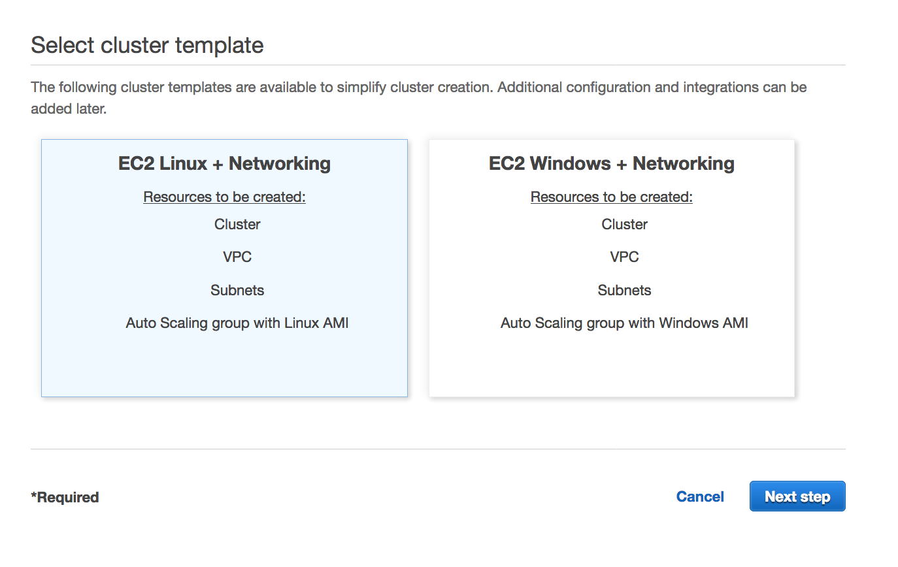 
 
 
3. Specify Cluster configuration

- Cluster Name 	        : Java-cluster
- EC2 instance type 	: m5.large
- Number of instances 	: 2
- Key Pair              : select your key pair


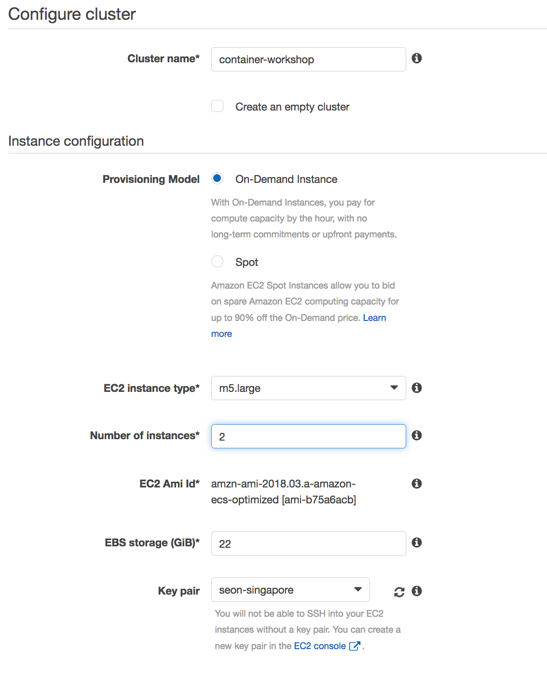 

- VPC : default VPC
- Subnets : Select 2 subnets
- Security Group : Create a new security Group **OPEN ALL PORT** , it is very important
- Role : Select a EC2 instance role to support your Task (need to create a new role)

- Need to Open all port in Security group, for dynamic port mapping of ALB 

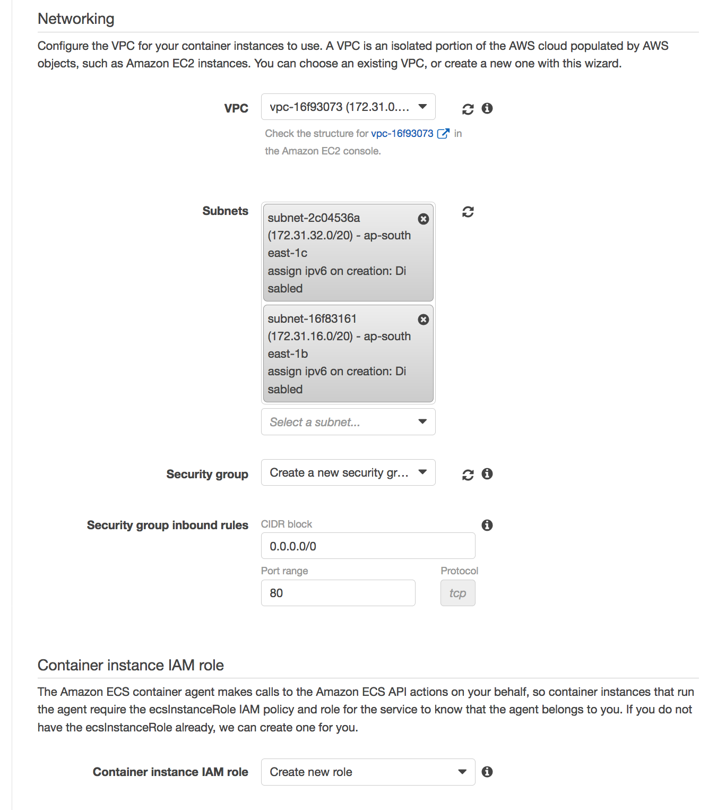 

3. Create a Resources
if you have error on creating IAM Role for instance, then create a role for ECS Instance Role and execute it again.


#### 1.4 Create a ALB

1. Create a ALB

- Specify name : <your initial>-alb-ecs-cluster
- Select the VPC which ECR is running on :
- Select all AZs

   

2. Create a security group
- Speficy name : <your initial>-alb-sg-default
- Open all TCP

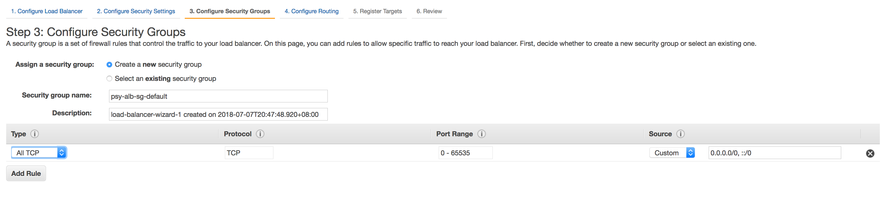 

3. Configure a default target group
- Specify name : <your initial>--alb-ecs-cluster-default-tg
- Select Instance as target type 

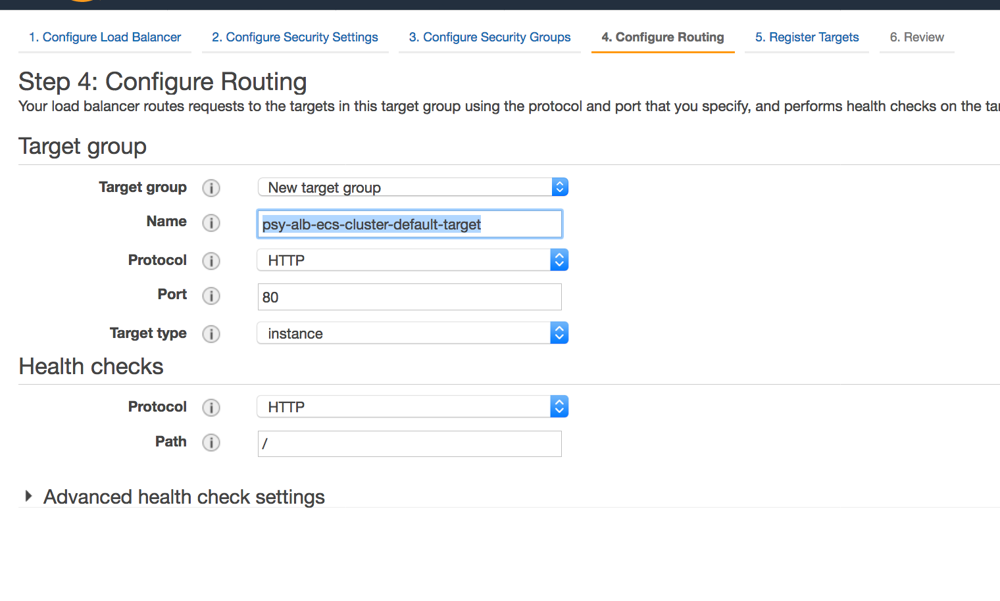 
 

4. Skip target registration
Don't register target instances here.

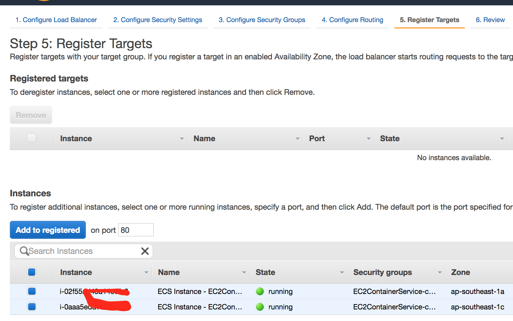 


#### 1.5 Create Task definition

1. Specify information

- Task Definition Name : <Your-Inital>-psy-contianer-task-hello
- Task Role : Creat a Amazon Elastic Container Service Task Role in IAM Role

- Add : S3, DyanmoDB, Watch logs, RDS, Rekognition, Translate
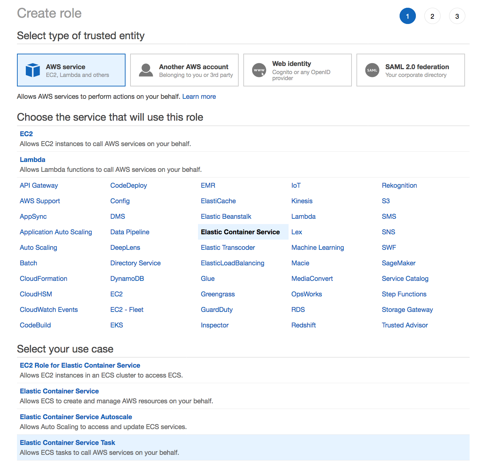 


- Network Mode : Bridge
- Task memory (MiB) : 512
- Task CPU (unit) : 1 vcpu


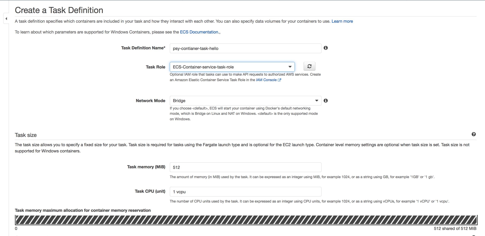 

2. Specify container information
	
- **Container name** : **java-container**
- **Image** : <YOUR ECR image ARN> (for example, <account-id>.dkr.ecr.ap-southeast-1.amazonaws.com/java-workshop	)
- Memory Limits (MiB) : 128
- Port mapping : 0 : 8080
- important !!! you need to specify host port as empty


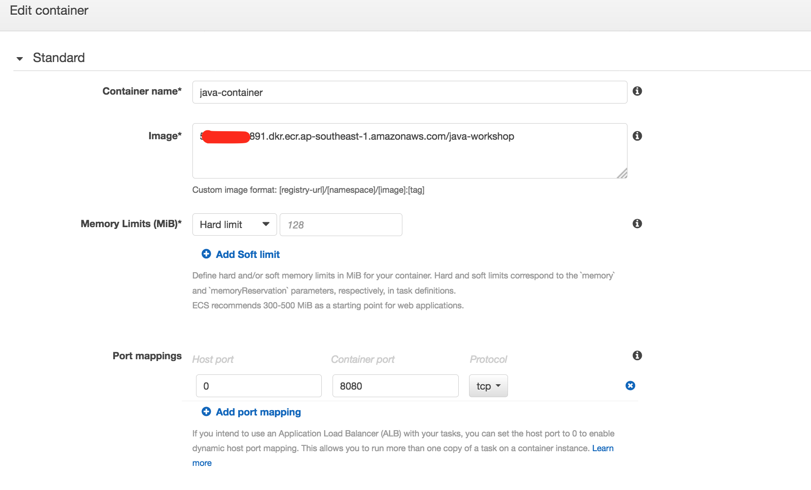 

3. Create a Task
Check a created task
 


#### 1.6 Create Service definition

1. Configure service
	
- Task Definition : Select a task you created in task definition (<your initial>-psy-container-task-hello)
- Cluster : select the cluster (container-workshop)
- Service name 						: java-service
- Number of tasks 					: 1
- Minimum healthy percent 	: 50
- Maximum percent 					: 200	

- Placement Templates : AZ Balanced spread

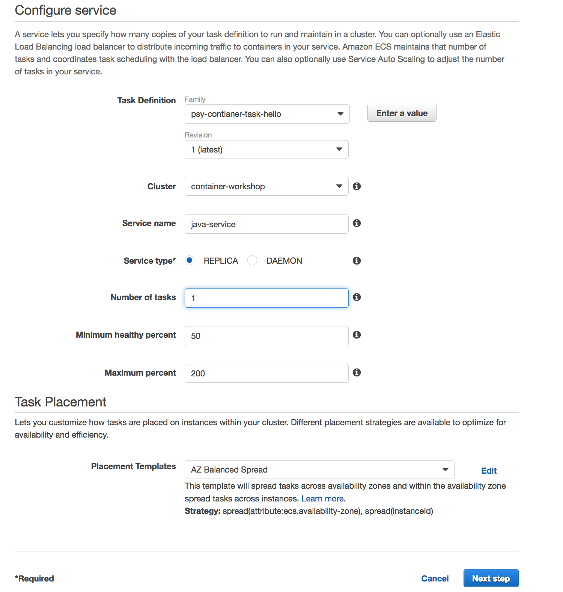 


2. Configure network
- Select a ALB you crated
- Specify Listner port : 80 HTTP
- Select "Create New" as target group name  
- Specify Path pattern : /
- Specify Evaluation Order : 1


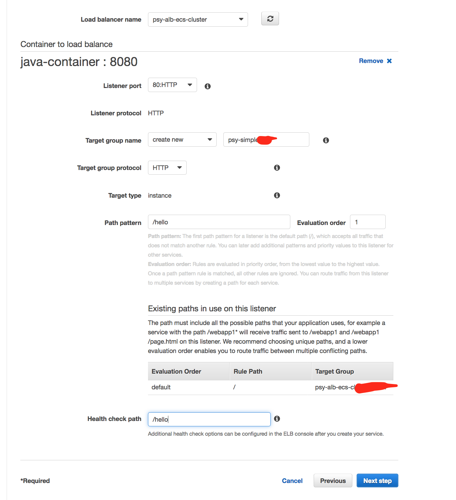 
 
  
3.	Cofigure autoscaling
- None

 
 

#### 1.7 Add one more service
- Specify Path Pattern : /workshop/users*
- Add ALB target group 
- Add health Check : /workshop/users/all


#### Confgratulation! You added 2 services in your ECS cluster.
 

<hr>
<hr>

### 2. Create a ECS cluster using CloudFormation

Use : 
https://github.com/aws-samples/ecs-refarch-cloudformation

Lauch a whole stack. and test it(see output of CloudFormation)

### 1. Customize the templates

1. (Recommendataion) download a zip file from 
https://github.com/aws-asean-builders/aws-container-workshop/tree/master/lab-03/cloudformation/original

and Unzip it.

1. (Optional) Clone the forked GitHub repository to your local machine.


```
git clone https://github.com/aws-samples/ecs-refarch-cloudformation.git

```


2. Modify the templates.
3. Upload them to an Amazon S3 bucket of your choice. Upload master.yml, template, service foders

- master.yml

  +- infrastructure/*

  +- services/*


4. Either create a new CloudFormation stack by deploying the master.yaml template, or update your existing stack with your version of the templates.


5. Change master.yml to point out your file location.

### 2. Lauch the stack with CloudFormaton


<hr>
<hr>

### 3. Create a ECS cluster using ECS-CLI (Optional)

1. Install ecs-cli :
https://docs.aws.amazon.com/AmazonECS/latest/developerguide/ECS_CLI_installation.html

Create an ECS cluster with these resources:


1. Create a infrastructure using Cloudformation
- Use **templates/infra.yaml**

```
cd templates

aws cloudformation deploy \
  --stack-name aws-infra-ecscli \
  --template-file infra.yaml \
  --region ap-southeast-1 \
  --capabilities CAPABILITY_IAM
```

```
aws cloudformation deploy \
  --stack-name aws-ecs-ec2 \
  --template-file master.yaml \
  --region ap-southeast-1 \
  --capabilities CAPABILITY_IAM
```

2. Run the follow command to capture the output from the CloudFormation template as key/value pairs in the file ecs-cluster.props. 

```
aws cloudformation describe-stacks \
  --region ap-southeast-1 \
  --stack-name aws-infra-ecscli \
  --query 'Stacks[0].Outputs' \
  --output=text | \
  perl -lpe 's/\s+/=/g' | \
  tee ecs-cluster.props
```

3. Setup the environment variables using the file (ecs-cluster.props)

```
set -o allexport
source ecs-cluster.props
set +o allexport
```

4. Configure ECS CLI
```
ecs-cli configure --cluster $ECSCluster --region ap-southeast-1
```

5. Create the task definition parameters for each of the service:

```
ecs-params-create.sh greeting
```

6. Start the greeting service up:

```
ecs-cli compose --verbose \
  --file greeting-docker-compose.yaml \
  --task-role-arn $ECSRole \
  --ecs-params ecs-params_greeting.yaml \
  --project-name greeting \
  service up \
  --target-group-arn $GreetingTargetGroupArn \
  --container-name greeting-service \
  --container-port 8081
```