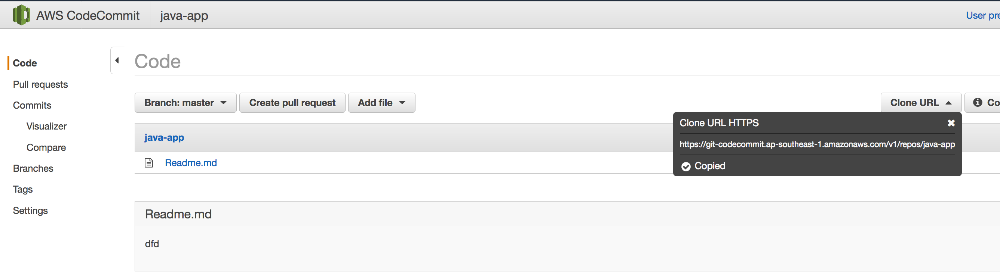
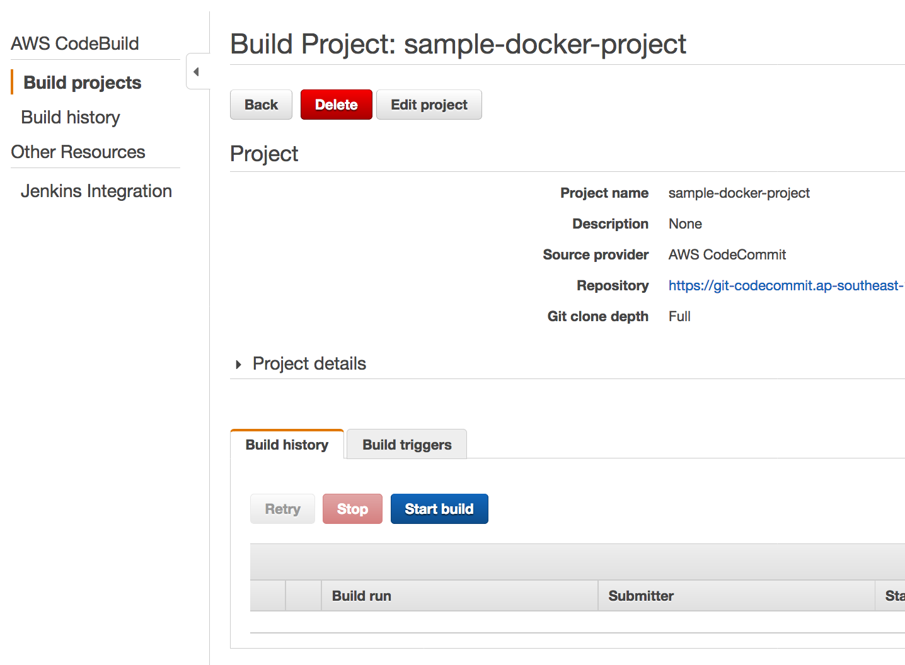
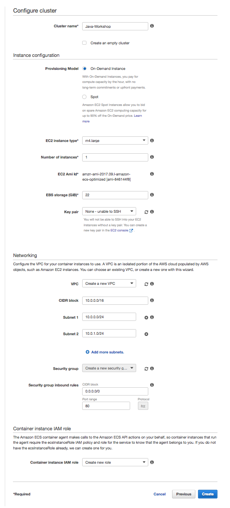
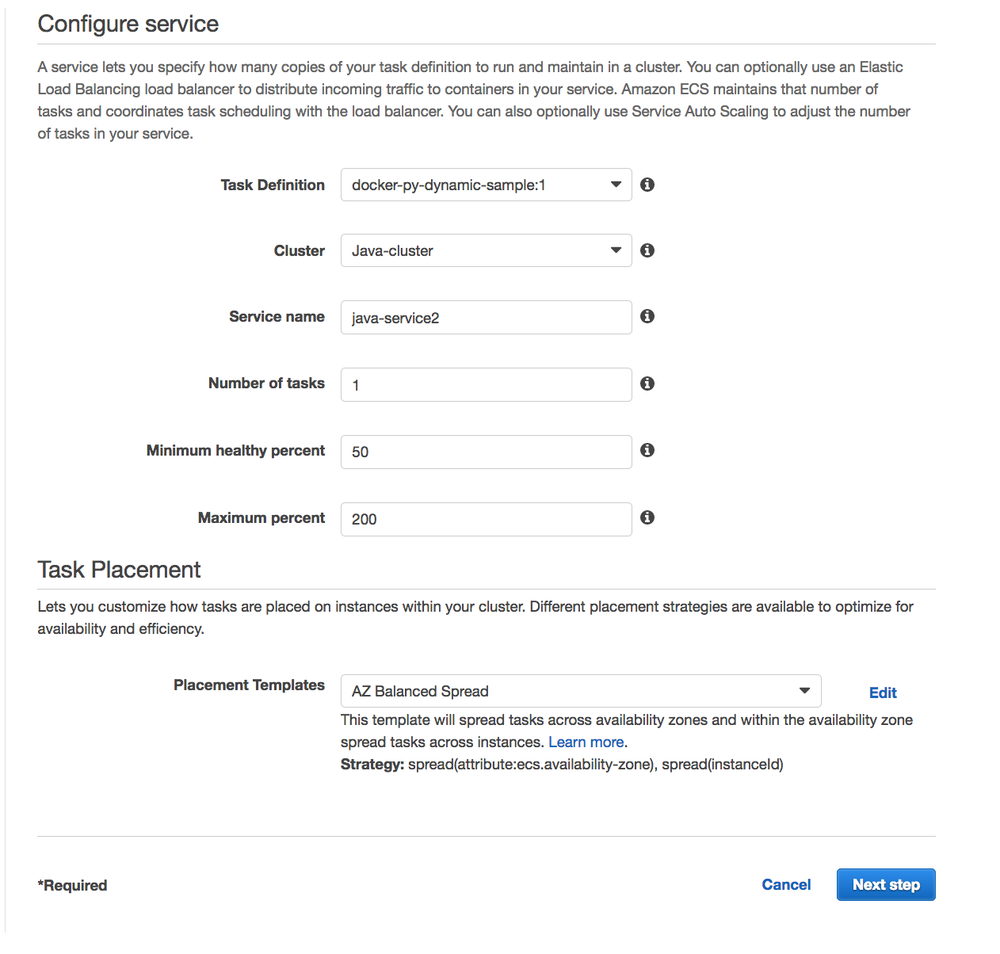

## Lab 3 : CI/CD for ECS
- Use a Lab-01 source and images to complete this lab.

### 1. Configure CodeCommit and Push your codes

#### 1.1. Create a CodeCommit repository
 
 Refer : 
  https://docs.aws.amazon.com/codecommit/latest/userguide/setting-up.html#setting-up-standard
 
1. create a repository in CodeCommit

```
 aws codecommit create-repository --repository-name <your repo name> --region <YOUR REGION>    
```

2. Clone your git repo

```
git clone <your repo URL>
```



3. Push your first code

```
cd <your repo directory>
vi Readme.md

git add .
git commit -m "first"
git push
```

#### 1.2. Commit a source to new CodeCommit repository

1. Copy your sorce codes into your project derectory you careated above step

```
cp -R ~/environment/aws-container-workshop/lab-01/* ~/environment/<your-repo>

```

2. Commit source code
	
```
git add .
git commit -m "first"
git push
```


#### 1.3 Create CodeBuild Service Role for docker images

1. Give a full CloudWatch Write privilege
2. Give a full ECR privilege
3. Give a full S3 access privilege
3. Give a full CodeCommit access

Create a policy "CodeBuild-Build-Policy"
Create a Role for CodeBuil and attach above policy

```
{
  "Version": "2012-10-17",
  "Statement": [
    {
      "Effect": "Allow",
      "Action": [
        "ecs:*",
        "ecr:*",
        "s3:*",
        "codecommit:*",
        "autoscaling:Describe*",
        "cloudwatch:*",
        "logs:*",
        "sns:*"       
      ],
      "Resource": "*"
    }
  ]
}

```


### 2. Create a builder project for a docker image

refer : https://docs.aws.amazon.com/codebuild/latest/userguide/sample-docker.html
	
- There is 2 builder json file. create-dock-builder.json and create-java-builder.json	
- create-java-builder.json is a file for creating CodeBuild for compiling and packaging Java source code to JAR output file.
- create-dock-builder.json is a file for creating CodeBuild for creating docker images 

	
#### 2.1. Change Builder files

1. Change the values accoriding to your environments
2. CodeCommit URL, region-ID, account-ID,Amazon-ECR-repo-name and role-name ARN

```
{
  "name": "sample-docker-project",
  "source": {
    "type": "CODECOMMIT",
    "location": "<YOUR code commit URL>"
  },
  "artifacts": {
    "type": "NO_ARTIFACTS"
  },
  "environment": {
    "type": "LINUX_CONTAINER",
    "image": "aws/codebuild/docker:17.09.0",
    "computeType": "BUILD_GENERAL1_SMALL",
    "environmentVariables": [
      {
        "name": "AWS_DEFAULT_REGION",
        "value": "region-ID"
      },
      {
        "name": "AWS_ACCOUNT_ID",
        "value": "account-ID"
      },
      {
        "name": "IMAGE_REPO_NAME",
        "value": "Amazon-ECR-repo-name"
      },
      {
        "name": "IMAGE_TAG",
        "value": "latest"
      }
    ]
  },
  "serviceRole": "arn:aws:iam::account-ID:role/role-name"
}

```

#### 2.2. Create a builder project

1. Create a Java builder

```
aws codebuild create-project --cli-input-json file://create-java-builder.json
```

2. Create a docker builder
	
```	
aws codebuild create-project --cli-input-json file://create-dock-builder.json
```

#### 2.3 Change buildspec.yml


#### 2.4. Start Build
- Run each CodeBuild, first, java builder then run docker builder

1. In your Codebuild Console, click a Start Build Button



	2. Select master branch


		

#### 2.5. Check Your Roles for CoudeBuild

If there is a failure, check your build result and if your role dosn't have enough privilege then add more access privilege on access policy.

1. Give a full CloudWatch Write privilege
2. Give a full ECR privilege


#### 2.6. Check pushed image in your local machine

1. You can describle the iamges withing a repository with following command.

```
aws ecr describe-images --repository-name java-workshop

```

2. Pull the image using the docker pull

```
docker pull <aws_account_id>.dkr.ecr.<your_region>.amazonaws.com/java-workshop:latest

docker pull 550622896891.dkr.ecr.ap-southeast-1.amazonaws.com/java-workshop:latest

docker images 

docker run -d -p 80:8080 --name=hello-world <IMAGE_ID>

docker run -d -p 80:8080 --name=hello-world 6f9c0d0b1c56

docker ps
```

### 3 Create a CICD for docker (new cluster)

https://docs.aws.amazon.com/AmazonECS/latest/developerguide/ecs-cd-pipeline.html


#### 3.1 Add imagedefinition.json in your root directory of source codes

- name is the container name you defined in task definition 

```
[
    {
        "name": "java-container",
        "imageUri": "550622896891.dkr.ecr.ap-southeast-1.amazonaws.com/java-workshop"
    }
]

```

### 4. Complete a CI/CD

#### 4.1 Add deploy stage

1. Add deploy stage in your CI/CD
- Action category: Deploy
- Action name : Specify your service name 
- Deployment provide : Amazon ECS
- Cluster name : Java-cluster (Specify your cluster name you created)
- Service name : java-service (Select service name you created )
- Image filename : imagedefinition.json (The file name you added in previous step)
- Input artifacts : Specify the artifact name of previous stage

 


#### 4.2 Deploy your application

1. Change code and deploy it
	
 	


<hr>
<hr>

### Lab 3-2 : Update your stack with CloudFormation (Continue from Lab 2, section 2)

- ECS has the ability to perform rolling upgrades to your ECS services to minimize downtime during deployments. For more information, see Updating a Service.

- To update one of your services to a new version, adjust the Image parameter in the service template (in services/* to point to the new version of your container image. 

- After you've updated the template, update the deployed CloudFormation stack; CloudFormation and ECS handle the rest.


### 1. Create a new services definition
1. Add user-service folder under **service**
2. Copy antoher service.yml to user-service

### 2. Modify a service.yml 

1. Update the ContainerName and Image parameters

2. Increment the ListenerRule priority number (no two services can have the same priority number - this is used to order the ALB path based routing rules).

3. Change TaskDefinition field to create a task definition

```
            LoadBalancers: 
                - ContainerName: "user-service"
                  ContainerPort: 8080
```

```
    TaskDefinition:
        Type: AWS::ECS::TaskDefinition
        Properties:
            Family: user-service
            ContainerDefinitions:
                - Name: user-service
                  Essential: true
                  Image: <your id>.dkr.ecr.ap-southeast-1.amazonaws.com/java-spring-app 
                  Memory: 1024
                  PortMappings:
                    - ContainerPort: 8080

```

```
            HealthCheckPath: /workshop/users/all
```

```
    ListenerRule:
        Type: AWS::ElasticLoadBalancingV2::ListenerRule
        Properties:
            ListenerArn: !Ref Listener
            Priority: 3
```
### 2. Update master.yml 

1. Add a new service 
```
    UserService:
        Type: AWS::CloudFormation::Stack
        Properties:
            TemplateURL: https://s3-ap-southeast-1.amazonaws.com/<your bucket>/ecs-cloudformation/services/user-service/service.yaml
            Parameters:
                VPC: !GetAtt VPC.Outputs.VPC
                Cluster: !GetAtt ECS.Outputs.Cluster
                DesiredCount: 2
                Listener: !GetAtt ALB.Outputs.Listener 
                Path: /workshop/users*   

```

```
Outputs:

    ServiceServiceUrl: 
        Description: The URL endpoint for the product service
        Value: !Join [ "/", [ !GetAtt ALB.Outputs.LoadBalancerUrl, "workshop/users/all" ]] 
```


